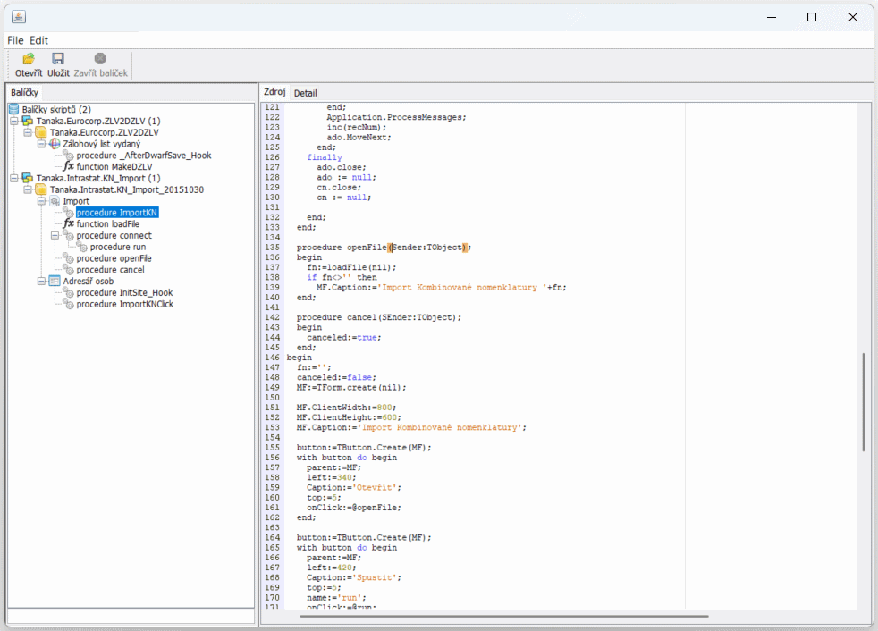

# ABRA Script Viewer

> Status: Archived — not actively maintained.

ABRA Script Viewer is a lightweight desktop tool for browsing Object Pascal scripts exported from the ABRA ERP system. It parses ABRA Script Package XML exports, builds a navigable tree of packages, scripts, and methods, and provides fast search and code viewing with basic syntax highlighting.

 Originally created in 2015, I built and used this app daily to make ABRA scripting more efficient, since ABRA only provided a plain text editor. This viewer makes it much easier to navigate large codebases and jump straight to procedures/functions.



## Key Features

- Load one or more ABRA script package exports (`ScriptPackageExport` XML)
- Drag-and-drop XML files or use the toolbar Open button
- Tree view grouped by package name, with icons for script kinds
- Automatic parsing of Object Pascal code into procedures/functions (incl. nested blocks)
- Quick filter of methods in the tree as you type
- Code viewer with basic syntax highlighting (via JSyntaxPane)
- Package detail tab showing metadata (name, description, note, encoding, password flag)
- Keyboard support: Enter to jump to code, Delete to remove package from the session

Note: The code editor pane is editable, but saving changes back into the XML is not implemented in this version. Treat it primarily as a fast viewer/navigator.

## How It Works

- XML parsing: The app reads `ScriptPackageExport` files and extracts Header fields (Name, Description, UsageState, RunOrder, Note, HashPassword) and Rows/Row entries (ScriptKind, ScriptID, ScriptData). Optional `Position` is respected.
- Code parsing: Object Pascal source is scanned with regular expressions (procedures/functions, begin/end, comments) to identify method headers and nesting, exposing them in the tree.
- UI: A Swing-based interface shows the package/script tree on the left and code/details on the right. JSyntaxPane provides baseline syntax highlighting.

## Project Structure

- `src/org/scriptbrowser/ABRAScriptBrowser.java` – App entry point (sets Look & Feel, opens main window)
- `src/org/scriptbrowser/MainForm.java` – Main Swing UI (tree, code pane, detail tabs, DnD)
- `src/org/scriptbrowser/XMLReader.java` – XML loader with BOM handling
- `src/org/scriptbrowser/XMLParser.java` – Parses package header metadata
- `src/org/scriptbrowser/ScriptPackage.java` – Represents a package and its scripts
- `src/org/scriptbrowser/Script.java` – Represents a script and its parsed methods
- `src/org/scriptbrowser/CodeParser.java` – Extracts procedures/functions from Pascal code
- `src/org/scriptbrowser/MethodDef.java` – Method metadata for the tree
- `src/org/scriptbrowser/PackageTreeModel.java` – Tree model with live filtering
- `src/org/scriptbrowser/PackageTreeCellRenderer.java` – Icons + labels for tree nodes
- `src/org/scriptbrowser/Agenda.java`, `BusinessObject.java` – Resolve display names for agendas/BOs from resources
- `src/resources/` – Icons, mappings (`Agendy.txt`, `BusinessObjects.txt`), and styles
- `doc/screenshot.png` – App screenshot used above

## Build and Run

This is a NetBeans/Ant-based Java project. The required runtime libraries are included in `src/libs/`.

Prerequisites:

- Java JDK 8 or newer
- Apache Ant (optional if using NetBeans)

Options:

1) NetBeans
- Open the project folder in NetBeans.
- Build/Run using the IDE actions (Ant build scripts under `nbproject/` are already configured).

2) Ant (CLI)
- From the project root, run:
  - `ant clean jar`
- The built JAR appears under `dist/`. You can run it with:
  - `java -jar dist/ABRAScriptViewer.jar`

If you build or run outside NetBeans, ensure the classpath includes the libraries from `src/libs/`.

## Usage

- Start the application.
- Load one or more ABRA script package XML files via the toolbar Open button or by dragging them into the window.
- Browse packages and scripts in the left tree; select nodes to view code or details.
- Use the filter field at the bottom of the tree to quickly find methods.
- Press Enter on a script/method to focus the code view; press Delete on a package to remove it from the current session.

## Releases

- Prebuilt artifacts are stored under `release/` in this repository:
  - Application JAR: `release/ABRAScriptViewer.jar`
  - Runtime dependencies: `release/libs/AbsoluteLayout-RELEASE270.jar`, `release/libs/jsyntaxpane-0.9.5-b29.jar`

Run from the `release` directory so the manifest `Class-Path` resolves the `libs/` folder:

```
cd release
java -jar ABRAScriptViewer.jar
```

If you move the JAR, also copy the `libs/` folder next to it, or adjust the classpath accordingly.

## Supported Input

- ABRA ERP Script Package XML exports in the form of `ScriptPackageExport` with a Header and Rows of script entries. Typical elements parsed:
  - Header: `Name`, `Description`, `UsageState`, `RunOrder`, `Note`, `HashPassword`
  - Rows/Row: `ScriptKind`, `ScriptID`, `ScriptData`, optional `Position` attribute

## Limitations

- Read-only workflow: there is no implemented save/export back to XML.
- Syntax highlighting is basic and uses a Java-oriented profile; parsing is regex-based and may not cover all Pascal edge cases.
- Mappings for Agenda/Business Object names depend on the included `Agendy.txt` and `BusinessObjects.txt` files.

## Credits

- Built with Java Swing and Ant
- Syntax highlighting: [JSyntaxPane 0.9.5 b29]
- Icons and mappings included in `src/resources/`

## License

No license file is provided. If you plan to use or redistribute this code, please add an appropriate license.
